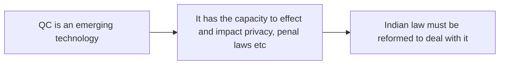

---
noteType:
  - idea
tags:
  - quantum_computing
  - tech
  - tech_law
---
## The old thesis
I spent a lot of time in the past year thinking about quantum computing and its impact on penal, international and constitutional law. I kept hitting a wall with my previous arguments because I was developing an argument that looked a lot like this:

All the while not realising that this was precisely the reason why my papers were failing:
- It grants too much agency to the technology itself. 
- It is easily dismissed as speculation. 
- It leads to shallow solutions.

## The new thesis

What I kept missing was that QC is not the reason why transgression of informational privacy would take place. QC is **merely the stressor**. There is an inherent problem with how we understand privacy, and the shortcomings in our current legislative and policy paradigm will only be accelerate in the post-quantum era, if we still choose to overlook them. Our inability to hold the State accountable to the same privacy standards it holds over Data Fiduciaries haunts the Indian privacy debate like a spectre that refuses to be exorcised. Neither political opposition nor judicial review has been able to hold the State accountable on privacy standards, which it evades by invoking the motif of 'national security', 'sovereignty', and 'public order'. In fact while the law currently is highly oppressive in the way it strips citizens of rights in 'cyberspace', its impact is not actually felt the implications of intentional policy loopholes have not been effected due to technical bottlenecks (remote encryption, etc). In this 'state of exception', it has been impossible to theoretically concretely argue for constitutional safeguards on privacy, because of its 'negative formulation' (State shall not) in the context of Art. 21. I thus posit, that the privacy crisis that will onset with the development of 'error corrected quantum computing' (especially when it finds itself first in the hands of the Government and wealthy corporations working at the behest of the Government) it will be catastrophic to our conception of privacy such that it will render constitutional safeguards as the only viable solution to maintain a semblance of the right to informational privacy. 

The work forward will have to focus on
- [[Tracing the 'State of Exception' in Privacy Law]]
- [[Autonomy of choice is the essential nature of privacy in Puttaswamy]]